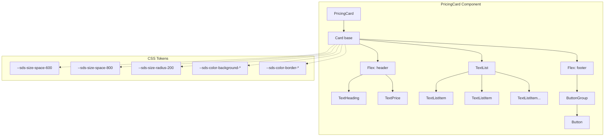

# PricingCard Figma Alignment - Brownfield Enhancement Architecture

**Version:** 1.0  
**Author:** Mauro (via Architect Agent Winston)  
**Date:** 2026-01-21  
**PRD Reference:** `docs/bmad/prd-pricing-card.md`  
**Status:** Draft

---

## 1. Introduction

This document outlines the architectural approach for enhancing the **Figma Simple Design System (SDS)** with the **PricingCard Figma Alignment** enhancement. Its primary goal is to serve as the guiding architectural blueprint for AI-driven development while ensuring seamless integration with the existing system.

**Relationship to Existing Architecture:**
This document supplements the existing project architecture by defining how the PricingCard enhancement will integrate with current systems. The project already has established patterns documented in `bmad/architecture.md` (FeatureCard); this enhancement follows those same patterns while focusing on design token verification and Figma Code Connect integration.

### 1.1 Existing Project Analysis

#### Current Project State

- **Primary Purpose:** React component library implementing the Figma Simple Design System (SDS)
- **Current Tech Stack:** React 18 + TypeScript 5 + Vite 6 + Storybook 8 + CSS Custom Properties
- **Architecture Style:** Component composition with atomic design principles (primitives → compositions)
- **Deployment Method:** Static build with Storybook documentation

#### Available Documentation

- `bmad/architecture.md` - FeatureCard architecture (establishes component patterns)
- `src/theme.css` - Design tokens auto-generated from Figma Variables
- `src/ui/compositions/Cards/` - Existing card component implementations
- Storybook stories for all existing components

#### Identified Constraints

- Must maintain backward compatibility with existing `PricingCardProps` interface
- All styling must use SDS design tokens (no hardcoded values)
- Must follow established `clsx` + CSS custom properties pattern
- Code Connect files must be placed in `src/figma/` directory structure

### 1.2 Change Log

| Change | Date | Version | Description | Author |
|--------|------|---------|-------------|--------|
| Initial Draft | 2026-01-21 | 1.0 | Architecture document created | Architect Agent Winston |

---

## 2. Enhancement Scope and Integration Strategy

### 2.1 Enhancement Overview

| Property | Value |
|----------|-------|
| **Enhancement Type** | Major Feature Modification |
| **Scope** | Single component (PricingCard) with documentation |
| **Integration Impact** | Low - verification and enhancement of existing component |

### 2.2 Integration Approach

| Integration Area | Approach |
|------------------|----------|
| **Code Integration Strategy** | Modify existing `PricingCard` in-place; no new files for component |
| **Database Integration** | N/A - UI component only |
| **API Integration** | N/A - No API changes |
| **UI Integration** | Verify/update CSS custom property usage in `cards.css` |

### 2.3 Compatibility Requirements

| Requirement | Details |
|-------------|---------|
| **Existing API Compatibility** | `PricingCardProps` interface must remain backward compatible |
| **Database Schema Compatibility** | N/A |
| **UI/UX Consistency** | Component must match Figma design within <2px variance |
| **Performance Impact** | Negligible - CSS-only changes with optional Code Connect file |

---

## 3. Tech Stack

### 3.1 Existing Technology Stack

| Category | Current Technology | Version | Usage in Enhancement | Notes |
|----------|-------------------|---------|---------------------|-------|
| **Language** | TypeScript | 5.x | Prop types, interfaces | No changes required |
| **Framework** | React | 18.x | Component implementation | No changes required |
| **Styling** | CSS Modules + Custom Properties | - | Token verification | May update values |
| **Class Composition** | clsx | 2.1.1 | Dynamic class names | No changes required |
| **Documentation** | Storybook | 8.6.12 | Story updates | Update stories |
| **Build** | Vite | 6.3.5 | Bundle generation | No changes required |
| **Figma Integration** | @figma/code-connect | 1.3.10 | Code Connect mapping | Create new mapping |

### 3.2 New Technology Additions

**None required.** All dependencies are already present in the project.

---

## 4. Data Models and Schema Changes

**Not Applicable.** This enhancement is purely UI-focused with no data model changes.

---

## 5. Component Architecture

### 5.1 Existing Component Structure

The `PricingCard` component already exists and follows established patterns:

```
PricingCard
├── Card (base component)
│   ├── variant: "default" | "stroke" | "brand"
│   ├── padding: "600" | "800"
│   └── direction: "vertical"
├── Flex (layout container)
│   ├── TextHeading (plan title)
│   └── TextPrice (price display)
│       ├── currency
│       ├── price
│       └── label
├── TextList (feature list)
│   └── TextListItem[] (individual features)
└── ButtonGroup > Button (CTA)
```

### 5.2 Component Integration Points

| Component | Integration Type | Purpose |
|-----------|-----------------|---------|
| `Card` | Base composition | Provides variant, padding, border-radius |
| `Flex` | Layout | Manages spacing and alignment |
| `TextHeading` | Primitive | Renders plan title |
| `TextPrice` | Primitive | Renders price with currency/label |
| `TextList` / `TextListItem` | Primitive | Renders feature list |
| `Button` / `ButtonGroup` | Primitive | Renders CTA action |

### 5.3 Props Interface (Existing - No Changes)

```typescript
export type PricingCardProps = {
  sku: string;
  interval: "month" | "year";
  heading: string;
  price: TextPriceProps["price"];
  priceCurrency: TextPriceProps["currency"];
  priceLabel?: TextPriceProps["label"];
  size?: TextPriceProps["size"];          // "large" | "small"
  variant?: CardProps["variant"];          // "default" | "stroke" | "brand"
  action: string;
  actionIcon?: ReactNode;
  actionVariant?: ButtonProps["variant"];
  actionDisabled?: boolean;
  onAction: () => void;
  list?: string[];
  listSlot?: ReactNode;
};
```

### 5.4 Component Interaction Diagram



---

## 6. API Design and Integration

**Not Applicable.** This enhancement does not require API changes.

---

## 7. External API Integration

**Not Applicable.** This enhancement does not require external API integration.

---

## 8. Source Tree

### 8.1 Existing Project Structure (Relevant Parts)

```
src/
├── ui/
│   ├── compositions/
│   │   └── Cards/
│   │       ├── Cards.tsx          # Contains PricingCard (lines 253-311)
│   │       ├── cards.css          # Card styles with CSS variables
│   │       └── index.ts           # Barrel export
│   └── primitives/
│       └── Text/                  # TextPrice, TextHeading, etc.
├── figma/
│   ├── compositions/
│   │   ├── Cards.figma.tsx        # Existing Card Code Connect
│   │   └── ...
│   └── primitives/
│       └── ...
├── stories/
│   └── compositions/
│       └── Cards.stories.tsx      # Existing card stories
└── theme.css                      # Design tokens from Figma
```

### 8.2 New File Organization

```
src/
├── ui/compositions/Cards/
│   ├── Cards.tsx                  # MODIFY: Verify token usage
│   └── cards.css                  # MODIFY: Verify/update token values
├── figma/compositions/
│   └── Cards.figma.tsx            # MODIFY: Add PricingCard Code Connect
└── stories/compositions/
    └── Cards.stories.tsx          # MODIFY: Update PricingCard stories
```

### 8.3 Integration Guidelines

| Aspect | Guideline |
|--------|-----------|
| **File Naming** | Follow existing pattern - no new files for component |
| **Folder Organization** | Code Connect in `src/figma/compositions/` |
| **Import/Export Patterns** | Maintain existing barrel exports |

---

## 9. Infrastructure and Deployment Integration

### 9.1 Existing Infrastructure

| Aspect | Details |
|--------|---------|
| **Current Deployment** | Static build via Vite + Storybook build |
| **Infrastructure Tools** | npm scripts, Vite, Storybook CLI |
| **Environments** | Development (local), Production (static build) |

### 9.2 Enhancement Deployment Strategy

| Aspect | Approach |
|--------|----------|
| **Deployment Approach** | No infrastructure changes required |
| **Infrastructure Changes** | None |
| **Pipeline Integration** | Existing `npm run build` covers all changes |

### 9.3 Rollback Strategy

| Aspect | Details |
|--------|---------|
| **Rollback Method** | Git revert - all changes are source-controlled |
| **Risk Mitigation** | Backward-compatible changes only |
| **Monitoring** | Visual regression via Storybook comparison |

---

## 10. Coding Standards

### 10.1 Existing Standards Compliance

| Standard | Project Pattern |
|----------|-----------------|
| **Code Style** | TypeScript with explicit types, functional components |
| **Linting Rules** | ESLint with React hooks plugin |
| **Testing Patterns** | Storybook for visual regression |
| **Documentation Style** | JSDoc comments for props, Storybook for usage |

### 10.2 Enhancement-Specific Standards

- **Token Usage:** All spacing, colors, and typography MUST use `--sds-*` CSS variables
- **No Magic Numbers:** Hardcoded pixel values are prohibited
- **Code Connect Mapping:** Props must map 1:1 with Figma component properties

### 10.3 Critical Integration Rules

| Rule | Implementation |
|------|----------------|
| **Existing API Compatibility** | `PricingCardProps` interface unchanged |
| **Database Integration** | N/A |
| **Error Handling** | Existing error boundaries apply |
| **Logging Consistency** | Console warnings for deprecated props only |

---

## 11. Testing Strategy

### 11.1 Integration with Existing Tests

| Aspect | Details |
|--------|---------|
| **Existing Test Framework** | Storybook + visual comparison |
| **Test Organization** | Stories in `src/stories/compositions/` |
| **Coverage Requirements** | All variants and sizes must have stories |

### 11.2 New Testing Requirements

#### Unit Tests for New Components

| Aspect | Details |
|--------|---------|
| **Framework** | Storybook (visual regression) |
| **Location** | `src/stories/compositions/Cards.stories.tsx` |
| **Coverage Target** | All variant × size combinations |
| **Integration with Existing** | Update existing PricingCard stories |

#### Integration Tests

| Aspect | Details |
|--------|---------|
| **Scope** | Verify PricingCard renders with all prop combinations |
| **Existing System Verification** | `pricingPlanToPricingCardProps` helper must work |
| **New Feature Testing** | Code Connect generates valid JSX |

#### Regression Testing

| Aspect | Details |
|--------|---------|
| **Existing Feature Verification** | Side-by-side comparison with current Storybook |
| **Automated Regression Suite** | Storybook snapshot comparison |
| **Manual Testing Requirements** | Figma overlay comparison for pixel accuracy |

---

## 12. Security Integration

### 12.1 Existing Security Measures

| Aspect | Details |
|--------|---------|
| **Authentication** | N/A - Component library |
| **Authorization** | N/A - Component library |
| **Data Protection** | No user data handled |
| **Security Tools** | ESLint security rules |

### 12.2 Enhancement Security Requirements

| Aspect | Details |
|--------|---------|
| **New Security Measures** | None required |
| **Integration Points** | N/A |
| **Compliance Requirements** | N/A |

### 12.3 Security Testing

| Aspect | Details |
|--------|---------|
| **Existing Security Tests** | ESLint rules |
| **New Security Test Requirements** | None |
| **Penetration Testing** | N/A |

---

## 13. Checklist Results Report

### Architecture Checklist Verification

| Item | Status | Notes |
|------|--------|-------|
| Existing codebase analyzed | ✅ | Cards.tsx, cards.css, theme.css reviewed |
| Integration points identified | ✅ | Card, Flex, Text primitives, Button |
| Technology compatibility verified | ✅ | All deps already present |
| Backward compatibility ensured | ✅ | Props interface unchanged |
| Coding standards documented | ✅ | Token-first, clsx pattern |
| Testing strategy defined | ✅ | Storybook visual regression |
| Deployment plan validated | ✅ | No infrastructure changes |

### Brownfield-Specific Validation

| Item | Status | Notes |
|------|--------|-------|
| Existing functionality preserved | ✅ | No breaking changes |
| Migration path defined | ✅ | N/A - enhancement in place |
| Rollback procedure documented | ✅ | Git revert |
| Integration testing planned | ✅ | Storybook + Figma comparison |

---

## 14. Next Steps

### 14.1 Story Manager Handoff

**Prompt for Story Manager:**

> Implement the PricingCard Figma Alignment enhancement per `docs/architecture.md`. This enhancement has 3 stories defined in the PRD:
>
> 1. **Story 1.1:** Verify and Update Design Token Usage
>    - Verify padding, gap, border-radius, colors match Figma MCP extraction
>    - Update `cards.css` if discrepancies found
>    - Integration checkpoint: Storybook renders without visual changes
>
> 2. **Story 1.2:** Create Code Connect Mapping
>    - Create Code Connect in `src/figma/compositions/Cards.figma.tsx`
>    - Map props to Figma component properties
>    - Integration checkpoint: `npx figma connect publish` succeeds
>
> 3. **Story 1.3:** Update Storybook Documentation
>    - Ensure stories exist for all variant × size combinations
>    - Add controls for all configurable props
>    - Integration checkpoint: No console errors in Storybook
>
> **Key constraints:**
> - No breaking changes to `PricingCardProps`
> - All values must use `--sds-*` CSS variables
> - Follow existing `clsx` pattern for class composition

### 14.2 Developer Handoff

**Prompt for Developer:**

> You are implementing the PricingCard Figma Alignment enhancement. Key references:
>
> **Architecture:** `docs/architecture.md`  
> **PRD:** `docs/bmad/prd-pricing-card.md`  
> **Component:** `src/ui/compositions/Cards/Cards.tsx` (lines 253-311)  
> **Styles:** `src/ui/compositions/Cards/cards.css`
>
> **Technical Decisions:**
> 1. Modify existing component in-place (ADR from existing architecture)
> 2. Add Code Connect to existing `Cards.figma.tsx` file
> 3. Use Storybook for visual regression testing
>
> **Implementation Sequence:**
> 1. First, verify current token usage against PRD Appendix A
> 2. Second, update CSS if discrepancies found
> 3. Third, add Code Connect mapping
> 4. Fourth, update Storybook stories
> 5. Finally, run `npm run storybook` to verify no regressions
>
> **Verification Steps:**
> - Inspect computed styles in DevTools to confirm token usage
> - Compare Storybook output to Figma screenshot
> - Run `npx figma connect publish` to verify Code Connect

---

## Appendix A: Design Token Reference (from PRD)

### Spacing Tokens

| Token | Value | Usage |
|-------|-------|-------|
| `--sds-size-space-200` | 8px | Title-description gap |
| `--sds-size-space-300` | 12px | - |
| `--sds-size-space-400` | 16px | Header flex gap (large) |
| `--sds-size-space-600` | 24px | Card padding (small), content gap |
| `--sds-size-space-800` | 32px | Card padding (large) |

### Border Tokens

| Token | Value | Usage |
|-------|-------|-------|
| `--sds-size-radius-200` | 8px | Card corner radius |
| `--sds-size-stroke-border` | 1px | Border width |

### Color Tokens

| Token | Value | Usage |
|-------|-------|-------|
| `--sds-color-background-default-default` | #ffffff | Default card background |
| `--sds-color-background-brand-default` | #2c2c2c | Brand card background |
| `--sds-color-border-default-default` | #d9d9d9 | Card border |
| `--sds-color-text-default-default` | #1e1e1e | Primary text |
| `--sds-color-text-default-secondary` | #757575 | Secondary text |
| `--sds-color-text-brand-on-brand` | #f5f5f5 | Text on brand background |

---

*Document generated by Architect Agent Winston using BMAD Brownfield Architecture Template v2.0*
