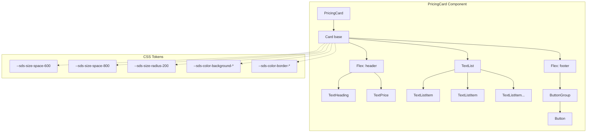

# 5. Component Architecture

## 5.1 Existing Component Structure

The `PricingCard` component already exists and follows established patterns:

```
PricingCard
├── Card (base component)
│   ├── variant: "default" | "stroke" | "brand"
│   ├── padding: "600" | "800"
│   └── direction: "vertical"
├── Flex (layout container)
│   ├── TextHeading (plan title)
│   └── TextPrice (price display)
│       ├── currency
│       ├── price
│       └── label
├── TextList (feature list)
│   └── TextListItem[] (individual features)
└── ButtonGroup > Button (CTA)
```

## 5.2 Component Integration Points

| Component | Integration Type | Purpose |
|-----------|-----------------|---------|
| `Card` | Base composition | Provides variant, padding, border-radius |
| `Flex` | Layout | Manages spacing and alignment |
| `TextHeading` | Primitive | Renders plan title |
| `TextPrice` | Primitive | Renders price with currency/label |
| `TextList` / `TextListItem` | Primitive | Renders feature list |
| `Button` / `ButtonGroup` | Primitive | Renders CTA action |

## 5.3 Props Interface (Existing - No Changes)

```typescript
export type PricingCardProps = {
  sku: string;
  interval: "month" | "year";
  heading: string;
  price: TextPriceProps["price"];
  priceCurrency: TextPriceProps["currency"];
  priceLabel?: TextPriceProps["label"];
  size?: TextPriceProps["size"];          // "large" | "small"
  variant?: CardProps["variant"];          // "default" | "stroke" | "brand"
  action: string;
  actionIcon?: ReactNode;
  actionVariant?: ButtonProps["variant"];
  actionDisabled?: boolean;
  onAction: () => void;
  list?: string[];
  listSlot?: ReactNode;
};
```

## 5.4 Component Interaction Diagram



---
