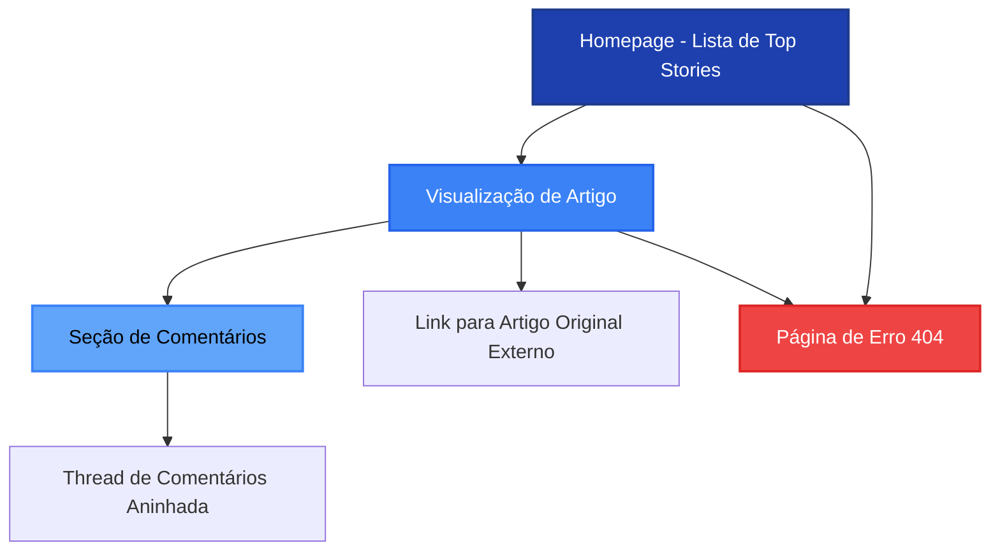
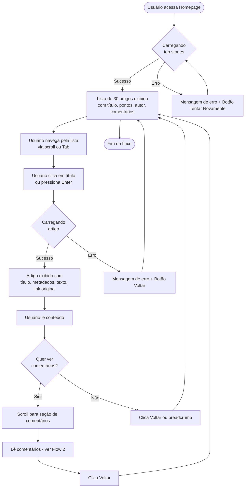
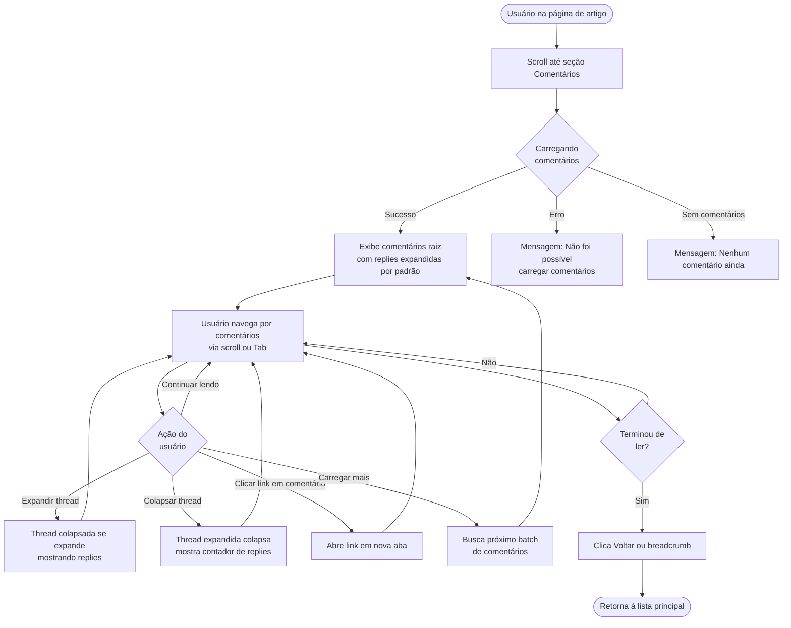

# HackerNews Redesign for Senior Tech Enthusiasts - Especificação UI/UX

---

## Introdução

Este documento define os objetivos de experiência do usuário, arquitetura de informação, fluxos de usuário e especificações de design visual para a interface do **HackerNews Redesign for Senior Tech Enthusiasts**. Ele serve como base para o design visual e desenvolvimento frontend, garantindo uma experiência coesa e centrada no usuário.

### Overall UX Goals & Principles

#### Target User Personas

**1. Tech-Savvy Senior (60-75 anos)**
- Profissional de tecnologia aposentado ou semi-aposentado
- Mantém interesse ativo em discussões técnicas e inovação
- Enfrenta desafios visuais (presbiopia) e pode usar leitores de tela
- Valoriza conteúdo de qualidade sobre velocidade de consumo
- Prefere interfaces claras e sem ruído visual

**2. Lifelong Learner (65+ anos)**
- Entusiasta de tecnologia sem background técnico profissional
- Curioso sobre tendências tecnológicas e startups
- Menos familiarizado com convenções de UI modernas
- Necessita de affordances visuais claras e feedback explícito
- Pode ter limitações motoras (precisão de clique/toque)

#### Usability Goals

1. **Facilidade de Aprendizado:** Novo usuário consegue navegar e ler artigos em menos de 2 minutos, sem necessidade de tutorial
2. **Legibilidade Extrema:** Todo texto legível sem esforço visual (min 16px, alto contraste, espaçamento generoso)
3. **Navegação Sem Ansiedade:** Usuário sempre sabe onde está e como voltar, sem medo de "se perder"
4. **Prevenção de Erros:** Feedbacks claros antes de ações irreversíveis (abrir links externos, etc.)
5. **Consistência Previsível:** Padrões de UI mantidos em toda aplicação, sem surpresas

#### Design Principles

1. **Dignidade Visual** - Design profissional e moderno que não infantiliza ou estereotipa usuários seniores
2. **Clareza Absoluta** - Priorizar comunicação clara sobre inovação estética; eliminar ambiguidade
3. **Affordances Explícitas** - Botões parecem botões, links parecem links, sem depender apenas de convenções modernas
4. **Espaço para Respirar** - Generosidade em padding, margins e line-height; interface "calma" visualmente
5. **Acessibilidade como Padrão** - WCAG 2.1 AA não é checklist, é fundação do design desde o início

#### Change Log

| Data | Versão | Descrição | Autor |
|------|--------|-----------|-------|
| 2026-01-20 | 1.1 | Substituição de Heroicons/emojis por Flaticon Uicons | Sally (UX Expert) |
| 2026-01-20 | 1.0 | Criação inicial da especificação UI/UX | Sally (UX Expert) |

---

## Arquitetura de Informação (IA)

### Site Map / Screen Inventory



### Navigation Structure

**Primary Navigation:** 
- Header fixo com logo/título "HackerNews Acessível" à esquerda
- Link "Home" sempre visível para retorno à lista principal
- Estrutura minimalista sem menu hamburger (apenas 2 páginas principais: Home e Article)

**Secondary Navigation:**
- Breadcrumbs na página de artigo: `Home > Título do Artigo`
- Botão "← Voltar" explícito no topo da página de artigo
- Links internos dentro de comentários (quando aplicável)

**Breadcrumb Strategy:**
- Breadcrumbs aparecem apenas na visualização de artigo
- Sempre mostram caminho completo: Home > Título abreviado (max 50 chars)
- Todos os elementos clicáveis e navegáveis via teclado
- Estruturados semanticamente com `<nav>` e `<ol>`

---

## User Flows

### Flow 1: Descobrir e Ler Artigo

**User Goal:** Encontrar artigo interessante na lista principal e ler conteúdo completo

**Entry Points:** 
- URL raiz da aplicação (`/`)
- Bookmark ou link compartilhado para homepage

**Success Criteria:** 
- Usuário consegue identificar artigo de interesse em menos de 30 segundos
- Usuário acessa artigo completo com um clique
- Conteúdo do artigo é totalmente legível e compreensível

#### Flow Diagram



#### Edge Cases & Error Handling

- **Artigo deletado/não encontrado:** Exibir mensagem "Este artigo não está mais disponível" com botão para voltar à lista
- **Timeout de API:** Após 10s, exibir "A requisição está demorando mais que o esperado" com opções Aguardar/Cancelar
- **Artigo sem texto (apenas link externo):** Mostrar metadados normalmente + botão destacado "Acessar Artigo Original"
- **Link externo quebrado:** Avisar usuário antes de abrir (não há controle sobre links externos)
- **Lista vazia (improvável mas possível):** Exibir "Nenhum artigo disponível no momento"

**Notes:** Este é o fluxo principal da aplicação (happy path). Performance crítica: lista deve carregar em <3s, artigo individual em <2s.

---

### Flow 2: Navegar e Expandir Comentários

**User Goal:** Explorar discussão em threads de comentários, expandindo/colapsando para focar em conversas relevantes

**Entry Points:** 
- Seção de comentários na página de artigo (scroll ou anchor link)
- Link direto para artigo com comentários

**Success Criteria:** 
- Usuário compreende hierarquia de respostas visualmente
- Usuário consegue colapsar threads longas sem perder contexto
- Navegação por teclado funciona perfeitamente através de comentários

#### Flow Diagram



#### Edge Cases & Error Handling

- **Comentário deletado:** Exibir placeholder `[comentário deletado]` em itálico cinza
- **Thread extremamente profunda (>10 níveis):** Limitar indentação visual a 5 níveis, continuar estrutura lógica
- **Comentário com HTML malicioso:** Sanitização via DOMPurify previne XSS, preserva formatação básica
- **Erro ao carregar replies específicas:** Exibir "Erro ao carregar respostas" inline, não bloquear thread inteira
- **Comentário muito longo (>5000 chars):** Considerar truncar com "Ver mais" (opcional para MVP)
- **Delay ao expandir thread grande:** Mostrar mini-spinner durante loading de replies

**Notes:** Performance crítica: expandir/colapsar deve ser instantâneo (<100ms). Para artigos com 100+ comentários, considerar virtualização ou paginação.

---

### Flow 3: Tratamento de Erros e Recovery

**User Goal:** Compreender problema quando algo dá errado e ter caminho claro para recovery

**Entry Points:** 
- Qualquer ponto da aplicação onde erro possa ocorrer

**Success Criteria:** 
- Usuário nunca vê erro técnico incompreensível
- Sempre há ação clara disponível (retry, voltar, contato)
- Estado da aplicação nunca fica "travado"

#### Flow Diagram

```mermaid
graph TD
    Error([Erro ocorre]) --> Type{Tipo de<br/>erro}
    
    Type -->|Network Error| Network[Exibe: Problema de conexão<br/>Verifique sua internet]
    Type -->|API Error 404| NotFound[Exibe: Conteúdo não encontrado<br/>Pode ter sido deletado]
    Type -->|API Timeout| Timeout[Exibe: Requisição demorou demais<br/>Tente novamente]
    Type -->|Component Error| ComponentErr[Error Boundary captura<br/>Exibe página de fallback]
    
    Network --> Actions1[Botões: Tentar Novamente | Voltar]
    NotFound --> Actions2[Botão: Voltar à Lista]
    Timeout --> Actions3[Botões: Tentar Novamente | Cancelar]
    ComponentErr --> Actions4[Botão: Recarregar Página]
    
    Actions1 --> Recovery{Usuário<br/>escolhe}
    Actions2 --> Recovery
    Actions3 --> Recovery
    Actions4 --> Recovery
    
    Recovery -->|Retry| Retry[Tenta requisição novamente]
    Recovery -->|Voltar| Back[Navega para página anterior]
    Recovery -->|Cancelar| Cancel[Permanece na página atual]
    Recovery -->|Reload| Reload[Recarrega aplicação]
    
    Retry --> Success{Sucesso?}
    Success -->|Sim| End1([Problema resolvido])
    Success -->|Não| PersistentError[Exibe erro persistente<br/>+ contato/ajuda]
    
    Back --> End2([Retorna à navegação normal])
    Cancel --> End3([Usuário continua])
    Reload --> End4([Aplicação reinicia])
```

#### Edge Cases & Error Handling

- **Erro consecutivo após 3 retries:** Sugerir "O serviço pode estar temporariamente indisponível. Tente novamente mais tarde."
- **Erro durante loading state:** Substituir spinner por mensagem de erro, não deixar spinner infinito
- **Multiple errors simultâneos:** Priorizar erro mais crítico, logar outros no console
- **Erro em background (cache, analytics):** Falhar silenciosamente, não interromper experiência do usuário
- **Browser incompatível:** Detectar em mount, exibir banner recomendando navegador moderno

**Notes:** Todas as mensagens de erro devem ser em português claro, evitando jargão técnico. Incluir emoji ou ícone visual para reforçar tipo de erro (❌ erro, ⚠️ warning, ℹ️ info).

---

## Wireframes & Mockups

**Primary Design Files:** Wireframes de baixa fidelidade incluídos neste documento. Para mockups de alta fidelidade, ver Figma (link será adicionado quando disponível).

### Key Screen Layouts

#### Screen 1: Homepage - Lista de Top Stories

**Purpose:** Exibir lista navegável de artigos principais do HackerNews de forma clara e acessível

**Key Elements:**
- **Header fixo** (altura ~80px): Logo "HN Acessível" à esquerda (ícone diamante + texto), título centralizado, área para futura navegação
- **Skip link** (invisível até focus): "Pular para conteúdo principal"
- **Main content area**: Lista de cards de artigos com padding generoso (20-24px entre cards)
- **Article card** (cada):
  - Título (heading h2, 20-24px, semibold, cor azul primário, clicável)
  - Metadados (16px, linha única): 🧑 autor | ↑ pontos | 💬 comentários | 🕐 tempo (ícones Flaticon)
  - Domínio do link externo (14px, cinza médio) se aplicável
  - Background branco com borda sutil, hover levanta card (box-shadow)
  - Área clicável mínima 60px altura total
- **Loading state**: 5 skeleton cards com shimmer animation
- **Error state**: Mensagem centralizada + botão "Tentar Novamente" (azul primário, 44x150px mínimo)
- **Footer**: Link para HackerNews original, nota sobre fonte de dados

**Interaction Notes:**
- Hover sobre card: elevação sutil (box-shadow), cursor pointer, título sublinha
- Focus (keyboard): outline azul espesso (3px) ao redor do card inteiro
- Click em qualquer parte do card navega para artigo
- Tab order: Skip link → cards (top to bottom) → footer links

**Design File Reference:** `wireframes/01-homepage.fig` (a ser criado)

---

#### Screen 2: Visualização de Artigo

**Purpose:** Exibir artigo individual com todos os metadados, texto (se houver) e acesso ao original

**Key Elements:**
- **Header** (mesmo da homepage)
- **Breadcrumb** (abaixo do header): Home > Título do artigo (truncado)
- **Botão Voltar** (canto superior esquerdo): "← Voltar" (texto + ícone Flaticon `fi-rr-angle-small-left`, 44x120px)
- **Article container** (max-width 800px, centralizado):
  - **Título** (h1, 28-32px, bold, azul escuro)
  - **Metadados row 1**: Tipo de post badge (pill azul claro) | 🧑 Autor | 🕐 "há X horas" (ícones Flaticon)
  - **Metadados row 2**: ↑ Pontos | 💬 Comentários | 🔗 Domínio (ícones Flaticon)
  - **Separador horizontal** (1px, cinza claro)
  - **Link para original** (botão secundário destaque): "🔗 Acessar Artigo Original →" (ícone Flaticon `fi-rr-link`, opens in new tab)
  - **Texto do artigo** (se tipo Ask/Show HN): Parágrafos com line-height 1.6, max-width 70ch
  - **Separador antes de comentários**
- **Comments section**: Veja Screen 3
- **Footer** (mesmo da homepage)

**Interaction Notes:**
- Botão "Voltar": hover muda background para azul claro, focus tem outline azul
- Link para original: hover sublinha + background azul muito claro
- Warning antes de abrir link externo (opcional): Tooltip "Abrirá em nova aba"
- Focus management: Ao carregar página, foco vai para h1 (title) com tabindex="-1"

**Design File Reference:** `wireframes/02-article-view.fig` (a ser criado)

---

#### Screen 3: Seção de Comentários

**Purpose:** Exibir hierarquia de comentários com controles de expansão/colapso

**Key Elements:**
- **Section heading** (h2): "Comentários (X)" onde X é total de comentários
- **Controles globais** (alinhados à direita):
  - Botão "Expandir Todos" | "Colapsar Todos" (toggle)
  - Dropdown "Ordenar por" (opcional para MVP): Mais antigos | Mais recentes
- **Comment thread** (estrutura recursiva):
  - **Comment container**: Background branco alternado com cinza muito claro por nível
  - **Indentação visual**: 32px por nível (máx 5 níveis visíveis)
  - **Borda lateral**: Linha vertical azul claro conectando replies ao parent (3px)
  - **Comment header**:
    - 🧑 Autor (bold se OP - Original Poster, ícone Flaticon `fi-rr-user`) | 🕐 "há X minutos/horas/dias" (ícone `fi-rr-clock`)
    - Badge "OP" se autor do comentário = autor do artigo
  - **Comment body**: Texto com line-height 1.5, 16px, preserva formatação básica
  - **Comment footer**:
    - Botão "⌄ Recolher" (se expandido, ícone `fi-rr-angle-small-down`) | "› Expandir (X respostas)" (se colapsado, ícone `fi-rr-angle-small-right`)
    - Link "Responder" (não funcional no MVP, cinza claro)
  - **Nested replies**: Renderizado recursivamente com indentação aumentada
- **Loading state**: Skeleton comments com animação
- **Empty state**: "Nenhum comentário ainda. Seja o primeiro a comentar no HackerNews original!"
- **Load more button** (se >20 comentários): "Carregar mais comentários" (botão secundário)

**Interaction Notes:**
- Collapse button: Ao clicar, thread desaparece com transition fade (200ms), botão muda para "Expandir (X)"
- Expand button: Ao clicar, thread aparece com fade-in (200ms)
- Keyboard nav: Tab percorre comentários em ordem hierárquica (depth-first), Enter ativa collapse/expand
- Long comments: Considerar "Ver mais" após 500 chars (opcional)
- Deleted comments: Exibir "[comentário deletado]" em itálico cinza, sem collapse button

**Design File Reference:** `wireframes/03-comments-section.fig` (a ser criado)

---

#### Screen 4: Estados de Loading e Erro

**Purpose:** Fornecer feedback visual claro durante carregamento e em situações de erro

**Key Elements:**

**Loading State (Homepage):**
- 5-6 skeleton cards com shimmer animation
- Cada skeleton: Retângulo para título, linha menor para metadados
- Animação shimmer: gradiente linear movendo da esquerda para direita, loop infinito

**Loading State (Article Page):**
- Skeleton para título (h1): retângulo largo no topo
- Skeleton para metadados: 2 linhas de retângulos menores
- Skeleton para texto: múltiplas linhas de largura variável (simulando parágrafos)

**Error State (Network Error):**
- Ícone centralizado (48x48px, vermelho suave, Flaticon `fi-rr-cross-circle`)
- Mensagem heading (h2): "Não foi possível conectar"
- Mensagem descritiva: "Verifique sua conexão com a internet e tente novamente"
- Botão primário: "Tentar Novamente" (azul, 44x180px, ícone `fi-rr-refresh`)
- Botão secundário: "Voltar para Início"

**Error State (404 - Artigo não encontrado):**
- Ícone centralizado (Flaticon `fi-rr-search`)
- Mensagem heading: "Artigo não encontrado"
- Mensagem descritiva: "Este artigo pode ter sido deletado ou o link está incorreto"
- Botão primário: "Voltar para Lista de Artigos"

**Error State (Timeout):**
- Ícone centralizado (Flaticon `fi-rr-time-fast`)
- Mensagem: "A requisição está demorando mais que o esperado"
- Dois botões: "Continuar Aguardando" | "Cancelar"

**Interaction Notes:**
- Todos os error states têm aria-live="polite" para anúncio a leitores de tela
- Loading states usam role="status" com aria-label="Carregando conteúdo"
- Botões de retry têm focus automático quando error state aparece
- Mensagens são sempre em português claro, sem jargão técnico

**Design File Reference:** `wireframes/04-states.fig` (a ser criado)

---

## Component Library / Design System

**Design System Approach:** Criar biblioteca de componentes customizada baseada em princípios de acessibilidade WCAG 2.1 AA. Não usar framework de UI pronto (Bootstrap, Material, etc.) para garantir controle total sobre acessibilidade e branding. Componentes Vue 3 com Composition API, utilizando Tailwind CSS para styling com design tokens customizados.

### Core Components

#### Component: Button

**Purpose:** Elemento clicável primário para ações do usuário

**Variants:**
- **Primary**: Background azul primário (#1e40af), texto branco, uso para ação principal (CTA)
- **Secondary**: Background branco, borda azul, texto azul, uso para ações secundárias
- **Ghost**: Transparente, texto azul, hover muda background, uso para ações terciárias (Voltar, etc.)
- **Danger**: Background vermelho suave (#ef4444), texto branco, uso para ações destrutivas (raras no MVP)

**States:**
- **Default**: Cores conforme variant
- **Hover**: Background 10% mais escuro, cursor pointer, transition 150ms
- **Focus**: Outline azul 3px offset 2px, sempre visível (não usar `outline: none`)
- **Active/Pressed**: Background 15% mais escuro, scale 0.98 (micro-animation)
- **Disabled**: Opacity 0.5, cursor not-allowed, sem hover/active effects
- **Loading**: Spinner branco/azul dentro do botão, texto "Carregando...", disabled state

**Usage Guidelines:**
- Altura mínima: 44px (toque acessível)
- Largura mínima: 100px (exceto ícone-only buttons)
- Padding horizontal: 24px
- Font size: 16px, font-weight: 600
- Border-radius: 8px (cantos suavemente arredondados)
- Sempre usar texto descritivo, evitar apenas ícones sem label
- Em mobile, buttons podem ser full-width para facilitar toque
- Máximo 2 buttons lado-a-lado (primary + secondary), restante em stack vertical

**Accessibility:**
- Usar elemento `<button>` semântico, não `<div>` com click handler
- Sempre incluir `type="button"` explícito (exceto submit buttons)
- Loading state deve ter aria-live="polite" e aria-busy="true"
- Disabled buttons devem ter aria-disabled="true" e explicação via tooltip se não óbvio

---

#### Component: Card (Article Card)

**Purpose:** Container para exibir preview de artigo na lista principal

**Variants:**
- **Default**: Background branco, borda cinza clara 1px, hover levita
- **Skeleton**: Background cinza claro com shimmer animation, durante loading

**States:**
- **Default**: Box-shadow sutil, border 1px solid #e5e7eb
- **Hover**: Box-shadow elevado (0 4px 12px rgba(0,0,0,0.1)), border azul claro, cursor pointer
- **Focus**: Outline azul 3px, box-shadow mantém elevation
- **Active**: Scale 0.99, transition rápida
- **Visited** (opcional): Título em roxo suave para indicar artigo já lido

**Usage Guidelines:**
- Padding interno: 20px (desktop), 16px (mobile)
- Margin entre cards: 16px vertical
- Border-radius: 12px
- Max-width: 900px (centralizado)
- Toda área do card é clicável (link envolve card inteiro)
- Título do artigo é h2 semanticamente
- Metadados em linha única com separadores visuais (|)
- Domínio do link externo em texto menor e cor secundária

**Accessibility:**
- Card é um `<article>` semântico dentro de `<a>` tag
- Heading h2 para título dentro do article
- Metadados em spans com ícones Flaticon que possuem aria-label apropriado
- Ícones têm aria-label descritivo ("Autor", "Pontos", "Comentários", "Tempo")
- Focus outline envolve card inteiro, não apenas título
- Keyboard: Tab para focar card, Enter para navegar

---

#### Component: Comment Thread

**Purpose:** Exibir comentário individual com suporte a nesting e collapse/expand

**Variants:**
- **Root comment**: Sem indentação, background branco
- **Nested comment**: Indentação progressiva, background alternado (branco/cinza#f9fafb)
- **Collapsed comment**: Apenas header visível, body e replies ocultos
- **Deleted comment**: Placeholder "[comentário deletado]" em itálico cinza

**States:**
- **Expanded** (default): Todo conteúdo visível, botão mostra "Recolher"
- **Collapsed**: Apenas header + contador replies, botão mostra "Expandir (X respostas)"
- **Loading replies**: Skeleton comments dentro do thread
- **Error loading**: Mensagem inline "Erro ao carregar respostas" + retry button

**Usage Guidelines:**
- Indentação: 32px por nível (máx 5 níveis visualmente distintos)
- Borda lateral esquerda: 3px sólida azul claro (#93c5fd) conectando a parent
- Padding interno: 16px
- Margin vertical entre comments: 12px
- Font-size body: 16px, line-height: 1.5
- Author name: bold, 16px, cor primária
- Timestamp: 14px, cor cinza médio, à direita do author
- Collapse button: Ghost variant, alinhado à esquerda no footer
- Suporta HTML sanitizado (parágrafos, links, code blocks)
- Code blocks: background cinza escuro, texto monospace, padding 12px

**Accessibility:**
- Estrutura de lista semântica: `<ul>` e `<li>` com nesting
- Cada comment é um `<article>` ou `<section>`
- Author como heading `<h3>` ou `<h4>` dependendo do nível
- Collapse button tem aria-expanded="true/false" e aria-controls="comment-{id}-body"
- Nível de nesting anunciado via aria-level ou heading hierarchy
- Keyboard: Tab navega entre comments e collapse buttons, Enter ativa collapse/expand

---

#### Component: Breadcrumb

**Purpose:** Mostrar hierarquia de navegação e localização atual

**Variants:**
- **Standard**: Home > Título da página atual

**States:**
- **Default**: Links em azul, separador ">" em cinza
- **Hover** (em links): Sublinha texto, cursor pointer
- **Focus**: Outline azul no link
- **Current page** (último item): Texto normal (não link), cor cinza escuro

**Usage Guidelines:**
- Font-size: 14px
- Padding vertical: 16px
- Separador: ">" com margin 8px horizontal
- Título da página truncado se >50 caracteres, com "..." no final
- Tooltip com título completo ao hover no truncado
- Posicionado abaixo do header, acima do conteúdo principal
- Max-width alinhado com conteúdo principal (800px)

**Accessibility:**
- Estrutura semântica: `<nav aria-label="Breadcrumb">` contendo `<ol>`
- Cada item é `<li>`, com link dentro (exceto current page)
- Current page tem aria-current="page"
- Screen readers anunciam "Breadcrumb navigation" e quantidade de níveis

---

#### Component: Loading Spinner / Skeleton

**Purpose:** Indicar loading state de forma clara e acessível

**Variants:**
- **Spinner**: Círculo animado rotacionando (uso em buttons e loading inline)
- **Skeleton**: Retângulos com shimmer animation (uso em placeholders de conteúdo)

**States:**
- **Animating**: Rotação contínua (spinner) ou shimmer loop (skeleton)

**Usage Guidelines:**

**Spinner:**
- Tamanho: 24px x 24px (default), 16px (small para buttons)
- Cor: Azul primário (#1e40af) em background branco, branco em background azul
- Animation: 360deg rotation, 1s linear infinite
- Sempre acompanhado de texto "Carregando..." visível ou via aria-label

**Skeleton:**
- Background: Linear gradient cinza claro → cinza médio → cinza claro
- Animation: Shimmer movendo da esquerda para direita, 1.5s ease infinite
- Border-radius: 8px (matching componente real)
- Altura: Matching componente real (ex: 60px para card, 32px para título)

**Accessibility:**
- Spinner: role="status" e aria-label="Carregando conteúdo"
- Skeleton: aria-busy="true" no container, aria-live="polite"
- Nunca usar apenas ícone sem texto (mesmo que visually-hidden)
- Timeout de 30s: Se loading persiste, mostrar mensagem de erro

---

## Branding & Style Guide

### Visual Identity

**Brand Guidelines:** Este projeto não possui brand guidelines corporativas existentes. A identidade visual é criada especificamente para este produto, focando em **profissionalismo, confiança e acessibilidade**. O design evita estereótipos de "UI para idosos" (fontes extra grandes, cores infantis) em favor de uma estética moderna e dignificada que beneficia todos os usuários.

**Brand Personality:**
- **Profissional**: Sério mas não corporativo, técnico mas não intimidador
- **Acessível**: Claro e direto, sem complexidade desnecessária
- **Confiável**: Consistente, previsível, sem surpresas
- **Respeitoso**: Trata usuários como adultos inteligentes, não infantiliza

### Color Palette

| Color Type | Hex Code | Usage |
|------------|----------|-------|
| Primary | `#1e40af` | CTAs principais, links importantes, headers, títulos clicáveis |
| Primary Light | `#3b82f6` | Hover states em elementos primários, backgrounds secundários |
| Primary Dark | `#1e3a8a` | Texto sobre backgrounds claros, ênfase adicional |
| Secondary | `#60a5fa` | Badges, pills, elementos decorativos, bordas de comentários |
| Accent | `#93c5fd` | Highlights sutis, backgrounds hover, indicadores visuais |
| Success | `#10b981` | Feedback positivo, confirmações, status de sucesso |
| Warning | `#f59e0b` | Avisos importantes, atenção necessária |
| Error | `#ef4444` | Mensagens de erro, ações destrutivas, validação falha |
| Neutral Gray 900 | `#111827` | Texto principal (body text), headings secundários |
| Neutral Gray 700 | `#374151` | Texto secundário, metadados |
| Neutral Gray 500 | `#6b7280` | Texto terciário, placeholders, timestamps |
| Neutral Gray 300 | `#d1d5db` | Bordas, separadores, divisores |
| Neutral Gray 100 | `#f3f4f6` | Backgrounds secundários, alternados |
| Neutral Gray 50 | `#f9fafb` | Background principal da aplicação |
| White | `#ffffff` | Cards, modals, elementos elevados |

**Contrast Validation:**
- Todas as combinações texto/background validadas para WCAG AA (mínimo 4.5:1)
- Principais combinações:
  - Gray 900 sobre White: 15.3:1 ✅
  - Primary sobre White: 9.7:1 ✅
  - Gray 700 sobre White: 11.2:1 ✅
  - White sobre Primary: 9.7:1 ✅
  - Gray 500 sobre White: 4.6:1 ✅ (limite mínimo, usar apenas para texto secundário)

### Typography

#### Font Families

- **Primary:** Roboto (sans-serif) - Fonte principal para todo o texto
  - Fallback: -apple-system, BlinkMacSystemFont, "Segoe UI", Arial, sans-serif
  - Import via Google Fonts: weights 400, 500, 600, 700
- **Secondary:** Roboto (mesma família) - Não há necessidade de fonte secundária neste projeto
- **Monospace:** 'Roboto Mono', 'Courier New', monospace - Para code blocks e elementos técnicos

**Rationale:** Roboto foi escolhida por:
- Alta legibilidade em tamanhos grandes e pequenos
- Formas de caracteres distintas (não confunde 1/l/I, 0/O)
- Suporte excelente a caracteres portugueses (ã, õ, ç)
- Kerning e spacing otimizados para leitura prolongada
- Disponível gratuitamente via Google Fonts

#### Type Scale

| Element | Size | Weight | Line Height |
|---------|------|--------|-------------|
| H1 (Page Title) | 32px (2rem) | 700 (Bold) | 1.2 (38px) |
| H2 (Section Heading) | 24px (1.5rem) | 600 (Semibold) | 1.3 (31px) |
| H3 (Subsection) | 20px (1.25rem) | 600 (Semibold) | 1.4 (28px) |
| Body Large | 18px (1.125rem) | 400 (Regular) | 1.6 (29px) |
| Body (Default) | 16px (1rem) | 400 (Regular) | 1.5 (24px) |
| Small (Metadados) | 14px (0.875rem) | 400 (Regular) | 1.4 (20px) |
| Button Text | 16px (1rem) | 600 (Semibold) | 1.2 (19px) |
| Link Text | 16px (1rem) | 500 (Medium) | 1.5 (24px) |

**Typography Guidelines:**
- **Mínimo absoluto:** 14px (usado apenas para metadados secundários)
- **Ideal para leitura prolongada:** 16-18px
- **Line-height mínimo:** 1.5 para body text, 1.2 para headings
- **Max line length:** 70 caracteres (~800px em 16px) para legibilidade ideal
- **Paragraph spacing:** 1.5em entre parágrafos
- **Letter-spacing:** Default (não ajustar), exceto headings grandes (-0.02em para tight)

### Iconography

**Icon Library:** Flaticon Uicons (Regular Rounded)
- **Rationale:** Biblioteca completa de ícones profissionais, consistentes e altamente legíveis, com excelente suporte para acessibilidade
- **CDN:** https://cdn-uicons.flaticon.com/
- **Licença:** Gratuita com atribuição (Free tier) ou Premium para uso comercial
- **Import:** 
  ```html
  <link rel='stylesheet' href='https://cdn-uicons.flaticon.com/2.6.0/uicons-regular-rounded/css/uicons-regular-rounded.css'>
  <link rel='stylesheet' href='https://cdn-uicons.flaticon.com/2.6.0/uicons-solid-rounded/css/uicons-solid-rounded.css'>
  ```
- **Size padrão:** 18-20px (metadata icons)
- **Size em buttons:** 20-24px
- **Size no logo:** 28px
- **Cor:** Cinza médio (#6b7280) para metadata, herda cor do texto em outros contextos

**Usage Guidelines:**
- Todos os ícones devem ter aria-label descritivo quando funcionais
- Ícones decorativos: aria-hidden="true"
- Usar variant "regular-rounded" (rr) como padrão para visual suave e acessível
- Usar variant "solid-rounded" (sr) apenas para ênfase em logos ou CTAs importantes
- Ícones sempre acompanhados de texto label (exceto casos óbvios como "X" para fechar)
- Screen readers devem anunciar o significado do ícone via aria-label

**Icon Set usado no projeto:**
- `fi-rr-user` - Autor/Usuário
- `fi-rr-arrow-small-up` - Pontos/Votos
- `fi-rr-comment` - Comentários
- `fi-rr-clock` - Timestamp/Tempo
- `fi-rr-link` - Link externo
- `fi-sr-diamond` - Logo da aplicação (variant solid)
- `fi-rr-angle-small-left` - Botão Voltar
- `fi-rr-angle-small-down` / `fi-rr-angle-small-right` - Expand/Collapse
- `fi-rr-cross` - Fechar/Erro
- `fi-rr-exclamation` - Warning
- `fi-rr-check-circle` - Success
- `fi-rr-refresh` - Retry/Recarregar

### Spacing & Layout

**Grid System:** 
- Container max-width: 1200px (desktop), 100% (mobile)
- Content max-width: 800px (artigo e texto longo)
- Padding horizontal container: 24px (desktop), 16px (mobile)
- Grid columns: Não usar grid complexo; layout é majoritariamente single-column centrado

**Spacing Scale:** (baseado em múltiplos de 4px)
- `xs`: 4px (0.25rem)
- `sm`: 8px (0.5rem)
- `md`: 12px (0.75rem)
- `base`: 16px (1rem) - **unidade base principal**
- `lg`: 20px (1.25rem)
- `xl`: 24px (1.5rem)
- `2xl`: 32px (2rem)
- `3xl`: 48px (3rem)
- `4xl`: 64px (4rem)

**Layout Guidelines:**
- **Padding interno de cards:** base (16px) em mobile, xl (24px) em desktop
- **Margin entre elementos:** lg (20px) mínimo para respirabilidade
- **Margin entre seções:** 3xl (48px) para separação clara
- **Header height:** 80px fixo em desktop, 64px em mobile
- **Footer height:** Dinâmico (min 120px)
- **Whitespace:** Generoso por padrão; design "calmo" prioriza espaço sobre densidade

**Responsive Breakpoints:**
- Mobile: 375px - 767px
- Tablet: 768px - 1023px
- Desktop: 1024px+
- Wide: 1440px+ (optional enhanced spacing)

---

## Accessibility Requirements

### Compliance Target

**Standard:** WCAG 2.1 Nível AA (conformidade total, não parcial)

**Rationale:** Este é um projeto fundamentalmente sobre acessibilidade. Conformidade AA não é uma "feature adicional" mas o próprio propósito do produto. Todos os critérios WCAG 2.1 AA devem ser atendidos sem exceções.

### Key Requirements

#### Visual

**Color contrast ratios:**
- Texto normal (16px+): Mínimo 4.5:1 contra background
- Texto grande (18px+ ou 14px+ bold): Mínimo 3:1
- Elementos de UI e gráficos: Mínimo 3:1
- Validação: Usar ferramenta WebAIM Contrast Checker em todas as combinações
- Nunca usar cor como único meio de transmitir informação (sempre texto ou ícone adicional)

**Focus indicators:**
- Outline azul sólido 3px (`outline: 3px solid #1e40af`)
- Offset de 2px para separar do elemento (`outline-offset: 2px`)
- Sempre visível, nunca usar `outline: none` sem alternativa
- Focus indicators consistentes em toda aplicação
- Estado de focus claramente distinguível de estado hover

**Text sizing:**
- Tamanho mínimo: 16px para corpo de texto (14px aceitável apenas para metadados secundários)
- Texto redimensionável até 200% sem perda de funcionalidade (usar unidades relativas: rem, em)
- Não usar `user-select: none` em texto (permitir seleção/cópia)
- Max-width de linha: 70-80 caracteres para facilitar leitura

#### Interaction

**Keyboard navigation:**
- 100% da aplicação navegável via teclado (sem necessidade de mouse)
- Tab order lógico (top-to-bottom, left-to-right, seguindo hierarquia visual)
- Enter ou Space ativam elementos interativos
- Escape fecha modals/overlays (se implementados no futuro)
- Skip link no início: "Pular para conteúdo principal" (visível ao focus)
- Focus nunca fica preso (focus traps apenas em modals, com gestão adequada)
- Atalhos de teclado (opcional MVP): não conflitam com browser/screen reader defaults

**Screen reader support:**
- HTML semântico em 100% do código (header, nav, main, article, aside, footer)
- Landmarks ARIA onde HTML semântico não é suficiente
- Labels descritivos em todos os elementos interativos
- Anúncios de loading/erro via aria-live regions
- Imagens decorativas com alt="" (empty alt), imagens funcionais com alt descritivo
- Formulários (se implementados) com labels explicitamente associados

**Touch targets:**
- Tamanho mínimo: 44x44px (seguindo guidelines Apple/Android)
- Espaçamento entre targets: mínimo 8px para evitar toques acidentais
- Área clicável pode ser maior que elemento visual (padding aumenta hit area)
- Gestos de swipe/drag evitados no MVP (apenas tap/click)

#### Content

**Alternative text:**
- Imagens de conteúdo: alt descritivo e conciso
- Imagens decorativas/ícones: alt="" ou aria-hidden="true"
- Emojis importantes: span com aria-label explicativo (ex: <span aria-label="pontos">⬆️</span>)
- Ícones SVG: `<title>` interno ou aria-label no container

**Heading structure:**
- Hierarquia lógica sem pulos (h1 → h2 → h3, nunca h1 → h3)
- Um único h1 por página (título principal)
- Headings descrevem o conteúdo que seguem
- Não usar headings apenas para styling (usar CSS)
- Screen readers usam headings para navegação rápida

**Form labels:**
- (Não aplicável no MVP, mas preparar para futuro)
- Todos os inputs têm `<label>` explicitamente associado via `for` attribute
- Placeholders não substituem labels
- Mensagens de erro associadas via aria-describedby

### Testing Strategy

**Automated Testing:**
1. **jest-axe** integrado em testes de componentes Vue
   - Executar em todos os componentes principais
   - CI/CD bloqueia merge se testes axe falham
2. **Lighthouse CI** em pipeline
   - Score de acessibilidade >= 100 requerido
   - Auditorias em todas as páginas principais (/, /story/:id)
3. **Axe DevTools** extension
   - Varredura manual durante desenvolvimento
   - Zero issues críticos permitidos

**Manual Testing:**
1. **Keyboard navigation** (30 min test session)
   - Desconectar mouse
   - Navegar 100% da aplicação via Tab/Enter/Space
   - Verificar focus visível em todos os elementos
   - Checklist: Home → Article → Comments → Back
2. **Screen reader** (1h test session)
   - NVDA (Windows) ou VoiceOver (Mac)
   - Fluxos principais narrados corretamente
   - Landmarks e headings funcionando
   - Loading states e erros anunciados
3. **Contrast verification**
   - WebAIM Contrast Checker em todas as combinações de cores
   - Screenshot + análise com ferramentas automáticas
4. **Browser zoom** (200% test)
   - Zoom de texto a 200%
   - Layout não quebra, funcionalidade mantida
   - Scroll horizontal minimizado

**Acceptance Criteria:**
- Zero issues críticos em automated tools (axe, Lighthouse)
- 100% navegável via teclado sem bloqueios
- Screen reader anuncia corretamente conteúdo e interações
- Contraste de todas as combinações >= 4.5:1 (ou 3:1 para texto grande)
- Documentação de testes em `docs/accessibility-testing.md`

---

## Responsiveness Strategy

### Breakpoints

| Breakpoint | Min Width | Max Width | Target Devices |
|------------|-----------|-----------|----------------|
| Mobile | 320px | 767px | iPhone SE, iPhone 12/13/14, Android phones |
| Tablet | 768px | 1023px | iPad, iPad Mini, Android tablets, landscape phones |
| Desktop | 1024px | 1439px | Laptops, small desktop monitors |
| Wide | 1440px | - | Large desktop monitors, 2K/4K displays |

**Testing Resolutions:**
- Mobile: 375x667 (iPhone SE), 390x844 (iPhone 14)
- Tablet: 768x1024 (iPad Portrait), 1024x768 (iPad Landscape)
- Desktop: 1280x720, 1920x1080
- Wide: 2560x1440 (optional enhancement)

### Adaptation Patterns

**Layout Changes:**

**Mobile (320-767px):**
- Single column layout exclusivamente
- Containers full-width com padding 16px
- Cards ocupam largura completa (no gap lateral)
- Stacking vertical de todos os elementos
- Metadados de artigo reorganizados verticalmente ou wrap em múltiplas linhas
- Header altura reduzida a 64px, título pode truncar
- Footer items stack verticalmente

**Tablet (768-1023px):**
- Layout ainda single-column, mas max-width 700px centralizado
- Padding lateral aumenta para 24px
- Cards mantêm max-width mas com margin lateral
- Metadados podem ficar em linha única se couberem
- Header full-height 80px
- Footer pode ter 2 colunas se múltiplos links

**Desktop (1024px+):**
- Max-width de conteúdo: 800px (artigo), 1200px (lista) centralizado
- Padding lateral generoso (32-48px dependendo da largura)
- Todos os metadados em linha única
- Hover states habilitados (não presentes em touch devices)
- Cards com espaçamento lateral

**Wide (1440px+):**
- Max-width mantido (não expandir indefinidamente)
- Padding lateral pode aumentar para 64px+
- Opcionalmente: Sidebar com índice ou metadados extras (futuro)

**Navigation Changes:**

**Mobile:**
- Skip link "Pular para conteúdo" sempre visível ao focus
- Breadcrumbs: Título de artigo truncado a 30 chars
- Botão "Voltar" full-width ou width mínima 150px, posicionado no topo
- Header: Logo/título centralizado ou esquerda, sem navegação extra

**Tablet/Desktop:**
- Breadcrumbs com título completo (ou truncado a 50 chars)
- Botão "Voltar" posicionado à esquerda, inline com breadcrumb
- Header: Logo esquerda, título centro (opcional), navegação direita (futuro)

**Content Priority:**

**Mobile:**
- Título do artigo: prioridade máxima, full-width, 24px (reduzido de 32px)
- Metadados: apenas essenciais visíveis imediatamente (autor, tempo), resto colapsado ou em linha seguinte
- Comentários: Indentação reduzida a 16px/nível (máx 3 níveis visualmente distintos)
- Link para artigo original: Botão full-width, destaque visual alto
- Loading states: Mensagens mais curtas ("Carregando...")

**Tablet:**
- Metadados: Todos visíveis em 1-2 linhas
- Indentação comentários: 24px/nível (máx 4 níveis)
- Link artigo original: Width natural (não full-width)

**Desktop:**
- Todos os metadados visíveis em linha única
- Indentação comentários: 32px/nível (máx 5 níveis)
- Espaçamento generoso entre todos os elementos

**Interaction Changes:**

**Mobile (Touch):**
- Hover states desabilitados (media query: `@media (hover: none)`)
- Touch targets mínimos 44x44px rigorosamente aplicados
- Buttons potencialmente full-width para facilitar toque
- Ripple effect ou active state visual em toques (feedback tátil via CSS)
- Scroll suave habilitado (`scroll-behavior: smooth`)
- Zoom de pinch habilitado (não usar `user-scalable=no`)

**Tablet (Hybrid):**
- Suporte a touch e mouse (devices como Surface)
- Hover states presentes mas touch targets mantidos grandes
- Layout híbrido: aproveita espaço de tablet mas assume touch-first

**Desktop (Mouse + Keyboard):**
- Hover states completos habilitados
- Cursor pointer em elementos clicáveis
- Tooltips aparecem ao hover (timing: 500ms delay)
- Scrollbars visíveis (não ocultar)
- Focus indicators otimizados para navegação Tab

---

## Animation & Micro-interactions

### Motion Principles

1. **Purposeful, Not Decorative:** Animações servem para comunicar mudança de estado ou orientar atenção, nunca apenas para "enfeitar"
2. **Fast and Subtle:** Durações curtas (150-300ms), sem distrair ou retardar interação
3. **Respect User Preferences:** Respeitar `prefers-reduced-motion` para usuários sensíveis a movimento
4. **Ease Over Linear:** Usar easing curves naturais (ease-out, ease-in-out), evitar linear ou bouncy excessivo
5. **Consistent Timing:** Mesmas durações e easings para interações similares em toda aplicação

### Key Animations

- **Button Hover:** Transition de background-color e box-shadow, Duration: 150ms, Easing: ease-out
- **Button Press:** Scale transform (0.98), Duration: 100ms, Easing: ease-in-out
- **Card Hover:** Box-shadow elevation increase, Duration: 200ms, Easing: ease-out
- **Link Hover:** Underline appearance com transition, Duration: 150ms, Easing: ease
- **Page Transition:** Fade-in do conteúdo, Duration: 250ms, Easing: ease-in (opcional, não bloquear navegação)
- **Collapse/Expand Comments:** Height transition com overflow hidden + fade opacity, Duration: 200ms, Easing: ease-in-out
- **Loading Spinner:** Rotate 360deg infinito, Duration: 1000ms, Easing: linear
- **Skeleton Shimmer:** Translate X de gradiente linear, Duration: 1500ms, Easing: ease-in-out infinite
- **Focus Indicator:** Instant (0ms) ou very fast (50ms), sem delay para indicador aparecer
- **Error Shake:** Translate X (-10px → 10px → 0), Duration: 300ms, Easing: ease-in-out (apenas em erros de validação críticos)
- **Success Fade-in:** Opacity 0 → 1 + translate Y (-10px → 0), Duration: 300ms, Easing: ease-out
- **Tooltip Appear:** Opacity 0 → 1 + scale (0.95 → 1), Duration: 150ms, Easing: ease-out, Delay: 500ms (hover)

**Reduced Motion:**
- Media query: `@media (prefers-reduced-motion: reduce)`
- Quando detectado: Todas as animações reduzidas a 0ms (instant) ou removidas
- Exceções: Focus indicators permanecem (acessibilidade crítica)
- Loading states: Substitui spinner rotativo por pulsing opacity simples

**Implementation Notes:**
- Usar CSS transitions e animations quando possível (melhor performance que JS)
- Vue transitions (`<Transition>`) para componentes condicionais (collapse/expand, page transitions)
- RequestAnimationFrame para animações JS complexas (não necessário no MVP)
- Will-change property usado com cautela (apenas em elements com animation frequent)

---

## Performance Considerations

### Performance Goals

- **Page Load (Homepage):** <3 segundos em banda larga (4G), <5 segundos em 3G
- **Interaction Response:** <100ms para feedback visual (hover, focus), <200ms para ações (click button)
- **Animation FPS:** 60fps consistente em todas as animações e scrolling

**Lighthouse Targets:**
- Performance: >=90
- Accessibility: 100 (não negociável)
- Best Practices: >=95
- SEO: >=90

### Design Strategies

**Asset Optimization:**
- **Fonts:** Usar apenas weights necessários do Roboto (400, 600, 700), subset para Latin + Latin Extended
- **Icons:** Inline SVG para ícones críticos (above fold), lazy load restante ou usar sprite sheet
- **Images:** (Futuras) WebP com fallback JPEG, lazy loading com intersection observer, responsive srcset
- **Favicon:** Otimizar para <10KB, fornecer múltiplos tamanhos

**Code Splitting:**
- Route-based splitting: HomePage e ArticlePage como chunks separados (Vue Router lazy loading)
- Component-level splitting: Carregar CommentThread apenas quando necessário (defineAsyncComponent)
- Vendor bundles: Separar dependencies grandes (DOMPurify) em chunk próprio

**Rendering Optimization:**
- **Virtual Scrolling:** Considerar para listas muito longas (>100 items), mas avaliar se adiciona complexidade desnecessária no MVP
- **Memoization:** Vue computed properties e v-memo para comentários aninhados (evitar re-renders)
- **Debounce/Throttle:** Aplicar em scroll events se houver listeners (não necessário no MVP)
- **Lazy Loading Comments:** Carregar apenas primeiros 20 comentários, "Load More" button para restante

**Caching Strategy:**
- **localStorage:** Cachear top stories por 5 minutos, cachear artigos individuais por 10 minutos
- **Service Worker:** (Futuro, não MVP) Estratégia stale-while-revalidate para API responses
- **HTTP Cache Headers:** Configurar em Vercel/Netlify para assets estáticos (fonts, icons) - cache longo com hashing

**Bundle Size:**
- Target: <500KB total JS bundle (main + chunks)
- Monitorar com bundlephobia.com e Vite bundle analyzer
- Evitar libraries pesadas desnecessárias (momentjs → usar date-fns ou Intl.DateTimeFormat nativo)

**Perceived Performance:**
- **Skeleton Screens:** Sempre preferir skeleton UI a spinners (dá sensação de velocidade)
- **Optimistic UI:** (Futuro) Mostrar estado de sucesso antes de confirmação da API (não aplicável a read-only MVP)
- **Instant Feedback:** Hover/focus states respondem imediatamente (0-50ms), não esperam network
- **Progressive Loading:** Mostrar conteúdo parcial enquanto resto carrega (ex: artigo sem comentários, depois adiciona)

**Monitoring:**
- Lighthouse CI em cada deploy
- Web Vitals tracking (Largest Contentful Paint, First Input Delay, Cumulative Layout Shift)
- Real User Monitoring (opcional): Google Analytics 4 com Web Vitals ou similar

---

## Next Steps

### Immediate Actions

1. **Review com Stakeholder:** Apresentar este documento ao Product Owner para validação de escopo e decisões de UX
2. **Criação de Mockups de Alta Fidelidade:** Usar Figma para criar screens detalhadas baseadas nestes wireframes e especificações (Homepage, Article View, Comments)
3. **Preparação para Handoff Técnico:** Reunir este documento + PRD + mockups Figma para passar ao Design Architect
4. **Validação de Cores:** Executar teste de contraste automatizado em todas as combinações de cores definidas, documentar resultados
5. **Prototipagem Interativa (opcional):** Criar protótipo clicável em Figma para testar navegação e fluxos com usuários potenciais

### Design Handoff Checklist

- [x] All user flows documented
- [x] Component inventory complete
- [x] Accessibility requirements defined
- [x] Responsive strategy clear
- [x] Brand guidelines incorporated
- [x] Performance goals established

---

## Checklist Results

_Se um checklist de UI/UX existir, executar contra este documento e reportar resultados aqui._

**Status:** Documento completo e pronto para fase de arquitetura técnica.

---

_Documento gerado por Sally (UX Expert) usando BMAD™ Core em 2026-01-20_
