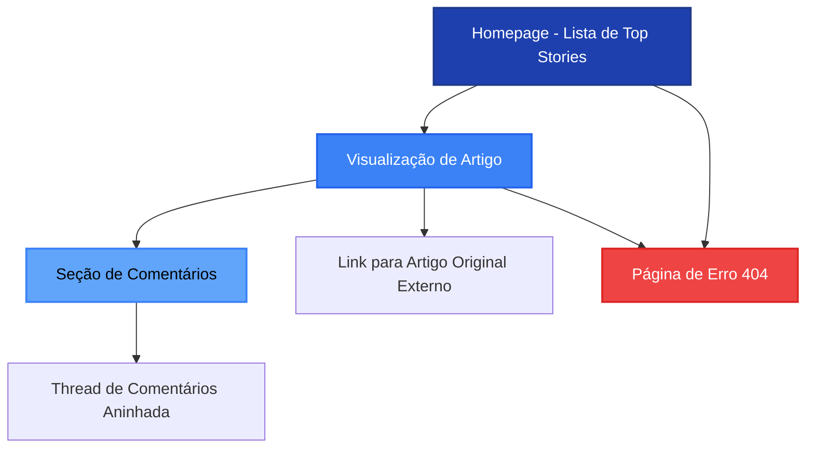

# Arquitetura de Informação (IA)

## Site Map / Screen Inventory

## Navigation Structure

**Primary Navigation:** 
- Header fixo com logo/título "HackerNews Acessível" à esquerda
- Link "Home" sempre visível para retorno à lista principal
- Estrutura minimalista sem menu hamburger (apenas 2 páginas principais: Home e Article)

**Secondary Navigation:**
- Breadcrumbs na página de artigo: `Home > Título do Artigo`
- Botão "← Voltar" explícito no topo da página de artigo
- Links internos dentro de comentários (quando aplicável)

**Breadcrumb Strategy:**
- Breadcrumbs aparecem apenas na visualização de artigo
- Sempre mostram caminho completo: Home > Título abreviado (max 50 chars)
- Todos os elementos clicáveis e navegáveis via teclado
- Estruturados semanticamente com `<nav>` e `<ol>`

---
