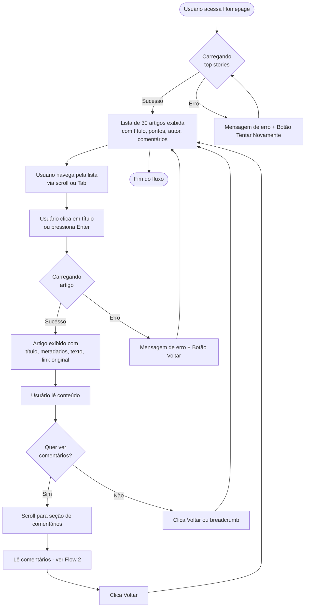
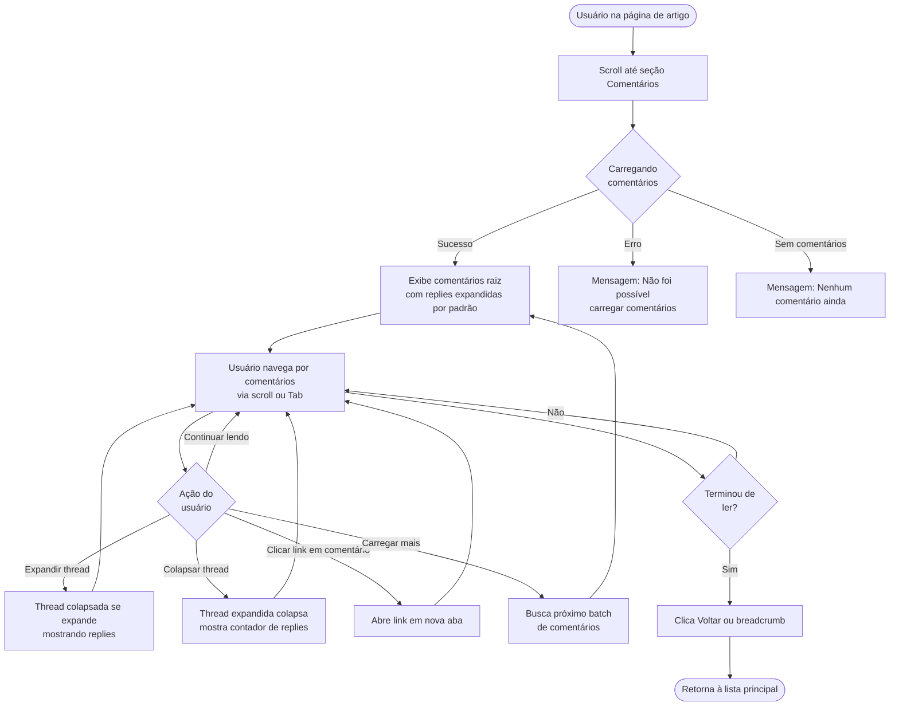

# User Flows

## Flow 1: Descobrir e Ler Artigo

**User Goal:** Encontrar artigo interessante na lista principal e ler conteúdo completo

**Entry Points:** 
- URL raiz da aplicação (`/`)
- Bookmark ou link compartilhado para homepage

**Success Criteria:** 
- Usuário consegue identificar artigo de interesse em menos de 30 segundos
- Usuário acessa artigo completo com um clique
- Conteúdo do artigo é totalmente legível e compreensível

### Flow Diagram



### Edge Cases & Error Handling

- **Artigo deletado/não encontrado:** Exibir mensagem "Este artigo não está mais disponível" com botão para voltar à lista
- **Timeout de API:** Após 10s, exibir "A requisição está demorando mais que o esperado" com opções Aguardar/Cancelar
- **Artigo sem texto (apenas link externo):** Mostrar metadados normalmente + botão destacado "Acessar Artigo Original"
- **Link externo quebrado:** Avisar usuário antes de abrir (não há controle sobre links externos)
- **Lista vazia (improvável mas possível):** Exibir "Nenhum artigo disponível no momento"

**Notes:** Este é o fluxo principal da aplicação (happy path). Performance crítica: lista deve carregar em <3s, artigo individual em <2s.

---

## Flow 2: Navegar e Expandir Comentários

**User Goal:** Explorar discussão em threads de comentários, expandindo/colapsando para focar em conversas relevantes

**Entry Points:** 
- Seção de comentários na página de artigo (scroll ou anchor link)
- Link direto para artigo com comentários

**Success Criteria:** 
- Usuário compreende hierarquia de respostas visualmente
- Usuário consegue colapsar threads longas sem perder contexto
- Navegação por teclado funciona perfeitamente através de comentários

### Flow Diagram



### Edge Cases & Error Handling

- **Comentário deletado:** Exibir placeholder `[comentário deletado]` em itálico cinza
- **Thread extremamente profunda (>10 níveis):** Limitar indentação visual a 5 níveis, continuar estrutura lógica
- **Comentário com HTML malicioso:** Sanitização via DOMPurify previne XSS, preserva formatação básica
- **Erro ao carregar replies específicas:** Exibir "Erro ao carregar respostas" inline, não bloquear thread inteira
- **Comentário muito longo (>5000 chars):** Considerar truncar com "Ver mais" (opcional para MVP)
- **Delay ao expandir thread grande:** Mostrar mini-spinner durante loading de replies

**Notes:** Performance crítica: expandir/colapsar deve ser instantâneo (<100ms). Para artigos com 100+ comentários, considerar virtualização ou paginação.

---

## Flow 3: Tratamento de Erros e Recovery

**User Goal:** Compreender problema quando algo dá errado e ter caminho claro para recovery

**Entry Points:** 
- Qualquer ponto da aplicação onde erro possa ocorrer

**Success Criteria:** 
- Usuário nunca vê erro técnico incompreensível
- Sempre há ação clara disponível (retry, voltar, contato)
- Estado da aplicação nunca fica "travado"

### Flow Diagram

```mermaid
graph TD
    Error([Erro ocorre]) --> Type{Tipo de<br/>erro}
    
    Type -->|Network Error| Network[Exibe: Problema de conexão<br/>Verifique sua internet]
    Type -->|API Error 404| NotFound[Exibe: Conteúdo não encontrado<br/>Pode ter sido deletado]
    Type -->|API Timeout| Timeout[Exibe: Requisição demorou demais<br/>Tente novamente]
    Type -->|Component Error| ComponentErr[Error Boundary captura<br/>Exibe página de fallback]
    
    Network --> Actions1[Botões: Tentar Novamente | Voltar]
    NotFound --> Actions2[Botão: Voltar à Lista]
    Timeout --> Actions3[Botões: Tentar Novamente | Cancelar]
    ComponentErr --> Actions4[Botão: Recarregar Página]
    
    Actions1 --> Recovery{Usuário<br/>escolhe}
    Actions2 --> Recovery
    Actions3 --> Recovery
    Actions4 --> Recovery
    
    Recovery -->|Retry| Retry[Tenta requisição novamente]
    Recovery -->|Voltar| Back[Navega para página anterior]
    Recovery -->|Cancelar| Cancel[Permanece na página atual]
    Recovery -->|Reload| Reload[Recarrega aplicação]
    
    Retry --> Success{Sucesso?}
    Success -->|Sim| End1([Problema resolvido])
    Success -->|Não| PersistentError[Exibe erro persistente<br/>+ contato/ajuda]
    
    Back --> End2([Retorna à navegação normal])
    Cancel --> End3([Usuário continua])
    Reload --> End4([Aplicação reinicia])
```

### Edge Cases & Error Handling

- **Erro consecutivo após 3 retries:** Sugerir "O serviço pode estar temporariamente indisponível. Tente novamente mais tarde."
- **Erro durante loading state:** Substituir spinner por mensagem de erro, não deixar spinner infinito
- **Multiple errors simultâneos:** Priorizar erro mais crítico, logar outros no console
- **Erro em background (cache, analytics):** Falhar silenciosamente, não interromper experiência do usuário
- **Browser incompatível:** Detectar em mount, exibir banner recomendando navegador moderno

**Notes:** Todas as mensagens de erro devem ser em português claro, evitando jargão técnico. Incluir emoji ou ícone visual para reforçar tipo de erro (❌ erro, ⚠️ warning, ℹ️ info).

---
